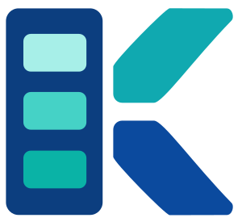
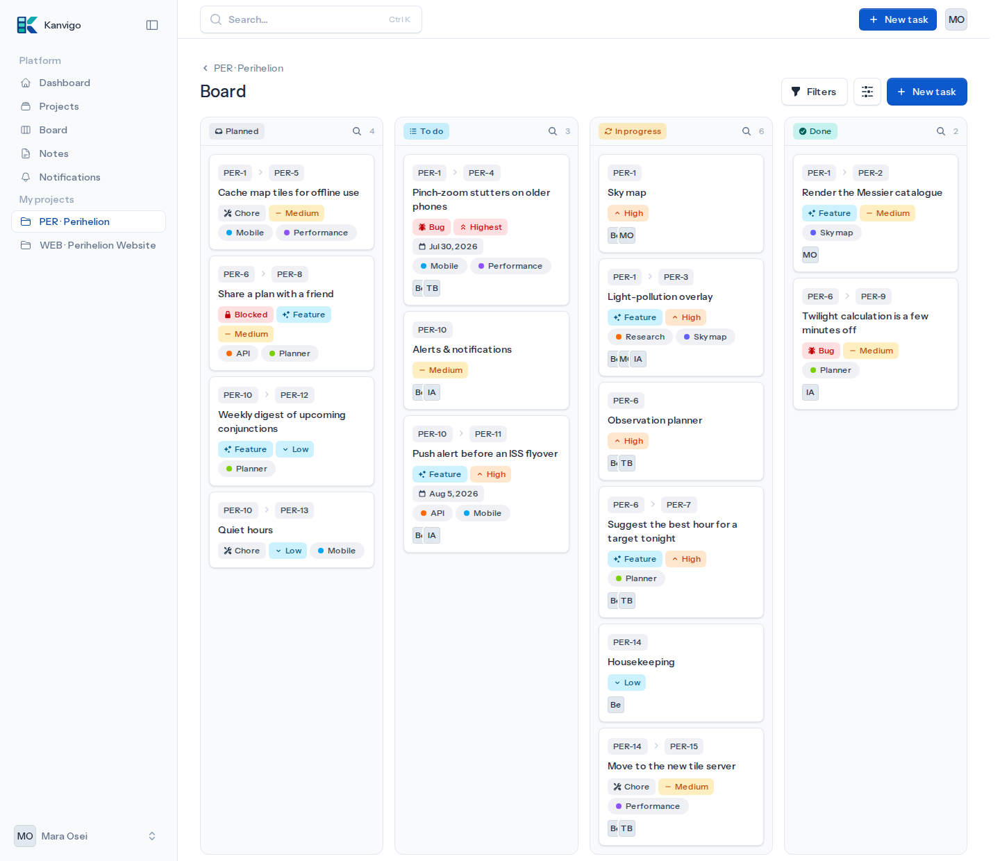

<p align="center">
  
</p>

<h1 align="center">Kanvigo</h1>

<p align="center">
  A minimalist, invitation-only Kanban project-management tool.<br>
  Organize work as <strong>Projects → nestable Tasks</strong>, on a board built for keyboards, agents and audits.
</p>

<p align="center">
  
  
</p>



Built on Laravel with Livewire and Flux UI. English and German out of the box.

> ⚠️ **Early development** — Kanvigo is still under active development and is **not
> yet considered production ready**. Expect breaking changes and use it in
> production at your own risk.

## Features

### Work management

- **Projects & nestable tasks** — a project holds tasks, and tasks nest into
  subtasks (configurable depth, default three) with flat per-project numbers. A
  task can be re-parented or detached, and parent/child status cascades are
  configurable (ask / always / never) in both directions.
- **Kanban board** — drag-and-drop across Planned, To do, In progress and Done,
  per project or globally. Touch-friendly, with a keyboard-accessible "Move to"
  menu on every card, per-column search, filters by priority, type and assignee,
  and manual card order. Live updates keep it current, never mid-drag.
- **Project overview** — a collapsible, filterable list of top-level tasks, each
  with its direct subtasks as quick links. Closed and archived tasks stay hidden
  until you ask for them.
- **Focused item views** — description front and centre, metadata (status,
  priority, assignees, dependencies, dates) gathered in a compact side rail.
  Status and priority are badges that open a dropdown, with one-click buttons to
  step status along the progression.
- **Create task dialog** — one dialog, opened from the board, a project, a parent
  task, the command palette or the toolbar, with project and parent preselected
  from where you opened it. "Create another" keeps it open for a run of tasks.
- **Progress rollups** — any task with subtasks shows a completion bar over its
  whole subtree, on the project overview and on the task page.
- **Priorities, types & due dates** — five priority levels (subtasks inherit
  their parent's), per-project task types (Feature, Bug and Chore by default,
  editable by admins), and due dates highlighted on the board when overdue.
- **Tags** — color-coded per-project labels with optional icons and synonyms
  they are also found by. A management page handles renaming, recoloring,
  merging and deleting. Tags and task types pick from the full icon set through
  a searchable picker.
- **Relationships** — typed links between tasks: blocks / blocked by, relates
  to, duplicates, clones and causes. Only blocking affects scheduling (a card is
  flagged "Blocked" while a blocker is open); cycles are rejected.
- **Cancellation & archiving** — abandon a task with a reason (Won't fix,
  Duplicate, Deprecated) instead of deleting it, or archive finished work. Both
  keep the full history and are reversible; Done tasks are auto-archived after a
  per-project threshold.
- **Dashboard** — per-status counts, a 14-day completion chart, and a "My tasks"
  list of your in-progress and to-do work plus unassigned to-do tasks.

### Writing & collaboration

- **Rich text everywhere** — descriptions, doc bodies and comments are written in
  a Flux/Tiptap WYSIWYG editor (stored as sanitized HTML) with headings, lists,
  links, quotes, code, tables inserted from a grid-size picker, and inline
  images pasted or dropped straight in.
- **Comments** — one-level replies, editing and soft-delete tombstones,
  collapsible per user, arriving live without disturbing a reply you're typing.
- **Mentions & references** — type `@` to mention a project member (notifying and
  subscribing them) or `#` to reference a task or doc. Both render as links with
  a hover preview card, and a reference links the two items, with a backlink on
  the target that disappears when the text does.
- **Reference docs** — statusless knowledge pages that belong to a project
  (`PROJ-D3`): specs, decisions and background, nested into a tree, drafts until
  published, each listing what it links to and everything that cites it. See
  [docs/using/reference-docs.md](docs/using/reference-docs.md).
- **Variables** — project-scoped stand-ins for facts that recur or are not
  decided yet: write `[main_protagonist]` in a description, doc or comment and it
  shows the current value, with an unset one rendering as a visible hole. Values
  change in one place, renaming rewrites the usages, deleting leaves the text
  untouched. See [docs/using/variables.md](docs/using/variables.md).
- **Quick notes** — jot a personal note from anywhere, optionally share it
  read-only with a project, and convert it into a task in one step. See
  [docs/using/quick-notes.md](docs/using/quick-notes.md).
- **Export** — take a task or doc out as Markdown or a standalone HTML page,
  copied to the clipboard or downloaded as a file, optionally with its whole
  subtree, its comments and a header of its metadata — or as a ZIP holding one
  file per item — or a whole project at once, for admins. See
  [docs/using/export.md](docs/using/export.md).
- **Attachments** — drag files onto a description to upload them, many at once
  if you like, with inline image and PDF thumbnails; oversized files are
  rejected with a clear message.
  Image attachments open in a lightbox gallery with keyboard navigation instead
  of a new tab.
- **Notifications** — subscribe per project or task; getting involved subscribes
  you automatically (creating a task, being assigned, commenting, being
  mentioned), and unsubscribing sticks — no trigger puts you back. There's an
  unread badge in the header and a management page.
  The panel lists unread first; dismiss a single notification or clear them all,
  and dismissed ones are removed for good after a month.
  The notifications page keeps the full history in an **Inbox** tab — filterable
  by read state, project, activity type and period, with bulk mark-read and
  dismiss — next to a **Subscriptions** tab for what you follow.
- **Activity feed** — one page with everything that happened across all your
  projects, newest first and grouped by day. Unlike notifications it isn't
  addressed at you: it answers "what did I miss?".
- **Profiles & avatars** — upload a profile picture (initials as the fallback);
  a profile page shows the projects you share with someone and their recent
  activity, visible only to people who share a project with them.
- **Multi-assignee tasks** — for pairing and ensemble work, with a one-click
  "assign to me".

### Navigation & appearance

- **Readable scoped URLs** — `/ABC` for a project, `/ABC/board` for its board,
  `/ABC-42` for a task and `/ABC-D3` for a doc. The browser tab title carries the
  same context, so many open tabs stay distinguishable.
- **Command palette** (`⌘K` / `Ctrl+K`) — search projects, tasks, docs and
  variables (by name or value, surfacing the pages that use them), jump straight
  to a typed reference (`PROJ-42`, `PROJ42`, `PROJ-D3`), find tasks by a bare
  number, and run quick actions such as creating a task or a doc.
- **Appearance** — English and German following the browser language, light and
  dark, and an optional full-width layout for large displays. Theme and language
  are also switchable straight from the account menu.

### Access & administration

- **Invitation-only onboarding** — public registration is disabled; users are
  invited by signed, expiring email links.
- **Authentication** — Fortify-backed login with email verification, two-factor
  and passkeys.
- **Project roles & membership** — each member holds one or more per-project
  roles and may do the union of their permissions. Owner, admin, member and a
  read-only viewer are seeded; custom roles are created under a parent role and
  bounded by its permissions, so delegation can never escalate. Managers assign
  roles as chips from the project page and only ever see roles at or below their
  own.
- **Cross-project access** — the account-level `access-all-projects` permission
  lets staff see every project. It grants visibility only; contributing still
  requires a role on the project.
- **User administration** — an admin-only area to review accounts, grant
  permissions, manage memberships, resend or revoke invitations, and deactivate
  or remove accounts. Removed accounts are soft-deleted; comments they wrote stay
  as the work of a "deleted user".
- **Authorization** — native Gates (`create-projects`, `access-all-projects`,
  `invite-users`, `create-api-tokens`, `manage-users`) over policies that resolve
  project access through inheritance-based delegated permissions.

### Audit & compliance

- **Activity log** — a polymorphic trail of creations, status, priority,
  assignment, tag and dependency changes, cancellations and reopenings, naming
  exactly what changed and flagging actions taken through an API or MCP token.
  Any entry can be discussed: **Discuss** drops a reference to it into the
  comment composer, and the posted comment links back to the entry.
- **Complete coverage** — beyond content changes, every security-relevant action
  is recorded for compliance sinks: authentication, membership and permission
  changes, invitations, edits and deletions across every surface (UI, MCP, REST),
  API-token lifecycle, and account deactivation or deletion.
- **Read/access auditing** — a curated slice of high-value reads is recorded too:
  reading the audit stream, viewing another member's contact info, attachment
  downloads, and opening the user-administration directory. Routine page and list
  reads are deliberately excluded.
- **Pluggable audit sinks** — every audited action is emitted once through a
  transactional outbox and fanned out to configurable sinks; the activity log is
  the default and needs no configuration. Self-hosters can register their own
  against `kanvigo/audit-contracts`, or add the optional
  [`kanvigo/audit-chronicle`](https://github.com/Fanmade/kanvigo-audit-chronicle)
  bridge for a hash-chained, tamper-evident ledger with WORM anchoring and GDPR
  crypto-shredding. See [docs/developing/audit.md](docs/developing/audit.md).
- **Audit event stream** — external systems (a SIEM, a compliance archiver) pull
  the instance-wide log from the REST API by cursor with at-least-once
  completeness, pseudonymized and minimized at the boundary. Requires the
  `manage-users` permission and an audit-scoped token.

### API & integrations

- **REST API** — a versioned, documented HTTP API under `/api/v1` for projects,
  tasks, docs, comments, assignees, dependencies and references. Bearer
  authentication, consistent JSON resources, paginated lists, and access scoped
  to the caller's projects exactly like the rest of the app. Interactive OpenAPI
  docs live at `/docs/api` (local only). See [docs/developing/api.md](docs/developing/api.md).
- **MCP server** — a Model Context Protocol endpoint at `/mcp`, secured by a
  bearer token or OAuth 2.1, that lets AI agents work with the projects, tasks,
  docs, notes and attachments the authenticated user can access. Attachments come
  back both as viewable content and as a short-lived signed download link, so an
  agent can fetch the original file. Read tools work
  with any token; write tools need a write token. Clients that require the OAuth
  flow (e.g. Claude Desktop) register dynamically and consent in the browser,
  optionally limited to selected projects, and are revocable under Settings → API
  tokens. Projects, tasks and docs are returned with their absolute URL on this
  instance, so agents link to the real board instead of guessing an address.
- **API tokens** — permitted users mint personal Sanctum tokens (read-only or
  read & write) from Settings and revoke them there. A token can be restricted to
  selected projects — handy for giving an agent access to a single project.

## Tech stack

- PHP 8.4+ / Laravel 13
- Livewire 4 + Flux UI Pro
- Laravel Fortify (login, email verification, 2FA, passkeys), Sanctum & Passport
- Tailwind CSS 4
- SQLite (default), Vite
- Pest 4, Larastan, Pint

> **Note:** This project uses [Flux UI Pro](https://fluxui.dev), a commercial
> package. A valid Flux Pro license is required to run `composer install`.

## Getting started

Requirements: PHP 8.4+, Composer, Node.js, and a Flux Pro license.

```bash
# Install dependencies, create .env, generate the key, migrate, and build assets
composer setup

# Seed the database (creates the configured admin and local demo data)
php artisan migrate:fresh --seed

# Run the full dev stack (server, queue, logs, Vite)
composer dev
```

The app is served at <http://localhost:8000>.

### Default admin

The seeder creates an administrator (with all permissions) only when you set
both credentials in your `.env`:

```dotenv
ADMIN_NAME="Admin"        # optional, defaults to "Admin"
ADMIN_EMAIL=you@example.com
ADMIN_PASSWORD=change-me
```

The admin can create projects and invite users. In `local`, the `DemoSeeder`
also populates two example projects for a fictional stargazing app — a named
team, typed and tagged tasks with subtasks, blockers, comments, notes and a doc
tree — so a fresh install looks like the screenshot above (it seeds its own demo
admin if none is configured).

Public registration is disabled: the admin invites everyone else by email. See
[Inviting users](docs/using/inviting-users.md).

## Testing & quality

The full quality gate runs Pint, Larastan and Pest:

```bash
composer test
```

Browser tests (Pest 4 + Playwright) are a separate suite, so the default gate
stays fast and Playwright-free:

```bash
composer test:browser
```

See [Testing & quality](docs/developing/testing.md) for the individual checks,
the coverage threshold and the browser-suite caveats.

## Documentation

Full index: [docs/README.md](docs/README.md).

- **Using Kanvigo** — [inviting users](docs/using/inviting-users.md),
  [quick notes](docs/using/quick-notes.md),
  [reference docs](docs/using/reference-docs.md),
  [export](docs/using/export.md).
- **Developing & integrating** — [REST API](docs/developing/api.md),
  [audit layer](docs/developing/audit.md),
  [testing & quality](docs/developing/testing.md).
- [CHANGELOG.md](CHANGELOG.md) — notable changes.
